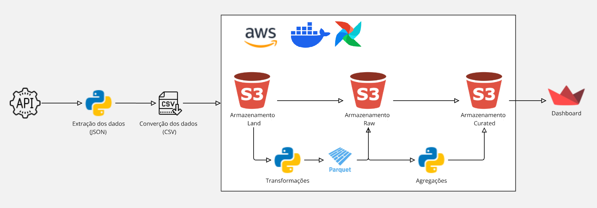

# BEES Data Engineering – Breweries Case


## Objetivo

O objetivo deste projeto é demonstrar minhas habilidades em consumir dados de uma API, transformando-os e persistindo-os
em um data lake seguindo a arquitetura medalhão com três camadas: dados brutos, dados selecionados
particionado por localização e uma camada analítica agregada.

## Arquitetura Proposta do Projeto



A arquitetura proposta é realizar a extração dos dados da API com python, extraindo no formato JSON, convertendo para csv e subindo para o S3 na camada Land, realizar as transformações com python, converter para Parquet e enviar para a camada Raw, da camada Raw realizar as agragações e manter o arquivo em Parquet e enviar para a camada Curated de onde será consumido pelo app (dashboard) com streamlit. 

## Configuração de ambiente

1 - Criar o repositório do projeto no GitHub (para quem for utilizar clonar)

2 - Setar a versão do Python para o projeto

```bash
pyenv local 3.11.5
```

3 - Iniciar o Poetry. 

```bash
poetry init
```
**OBS**: Para o projeto iniciei de forma basica sem customizar o poetry, somente seguindo com enter

4 - Vincular a versão do python com o poetry

```bash
poetry env use 3.11.5
```
**OBS**: Airflow roda somente no python 3.11 até este momento.

5 -  Ativar ambiente virtual criado pelo Poetry
```bash
poetry shell
```

6 - Instalar as bibliotecas pertinentes ao projeto.


```bash
poetry add <biblioteca>
```

**OBS**: Como estamos utilizando o poetry como gerenciador do ambiente, usar o comando para cada biblioteca. Para facilitar criei um requirements.txt com as bibliotecas do projeto

## Criação da conta AWS

**Acessar o site da AWS:**

- Vá para [AWS](https://aws.amazon.com/).
- Iniciar o processo de criação de conta como nome de usuário, senha, método de pagamento, verificação de identidade e seleção do plano.

**Criação dos Buckets das camadas**

- Pesquisar S3 pelo console da AWS
- Crie três buckets para as diferentes camadas do data lake.
    - `breweries-lake-land`
    - `breweries-lake-raw`
    - `breweries-lake-curated`

**Gerenciar usuário e permissões dos buckets das camadas de armazenamento**

- Pesquisar IAM pelo console da AWS
- Criar usuário do IAM
- Especificar o tipo de acesso e as permissões do usuário


## Requisição da API e Ingestão no S3

- Os dados são requisitados na [API](https://api.openbrewerydb.org/breweries)
- São extraidos em formato JSON
- São convertidos para DataFrame
- É feito um buffer na memoria para passar os dados para csv
- CSV é inserido na camada land do S3

## Configurando Aiflow com docker

Primeiramente é importante ter na maquina instalado Docker, Docker Compose e WSL para facilitar a manipulação dos container

Baixando as imagens das ferramentas que precisaremos

```bash
docker pull apache/airflow:2.7.1
docker pull postgres:13
docker pull redis:7.0
```

Iniciar container e banco do airflow

```bash
docker compose up airflow-init
```

Iniciar os serviços do airflow

```bash
docker compose up -d
```

Se necessário, encerrar o container com:
```bash
docker compose down
```

## Para rodar o dashboard
```bash
streamlit run app/dashboard.py
```

